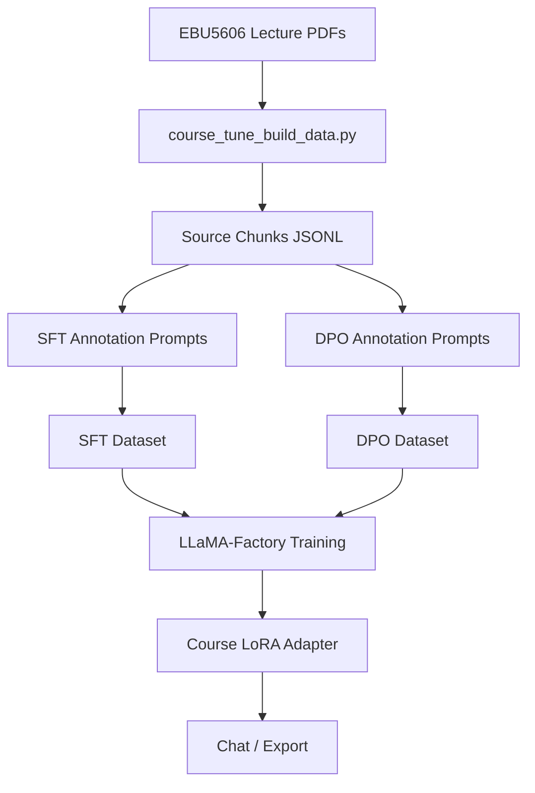

<p align="right">

English · [中文](README_zh.md)

</p>

<h1 align="center">CourseTune Product Development</h1>
<p align="center">
  <strong>A lightweight Qwen3 LoRA/DPO fine-tuning project for the EBU5606 Product Development course.</strong>
  <br />
  <em>Course PDF extraction · SFT dataset construction · DPO preference alignment · LLaMA-Factory configs</em>
</p>

<p align="center">
  <a href="#quick-start"></a>
  <a href="LICENSE"></a>
</p>

<p align="center">
  
  
  
  
</p>

## Features

| Feature | Description |
|---|---|
| Course-focused dataset | Builds training data from EBU5606 Product Development lecture PDFs. |
| Source-bound extraction | Converts local PDF/PPTX/TXT/Markdown files into JSONL chunks and annotation prompts. |
| SFT and DPO samples | Includes reviewed sample data for supervised fine-tuning and preference alignment. |
| Training configs | Provides Qwen3 LoRA SFT, DPO, inference, and merge YAML files for LLaMA-Factory. |
| Public-safe repository | Generated chunks and annotation prompts are ignored because they may contain course material text. |

## Quick Start

### Install

```bash
pip install -r requirements.txt
```

### Build Product Development Prompts

```bash
python scripts/course_tune_build_data.py \
  --source "/Users/gumishdo/Desktop/大三下/产开" \
  --name-regex "^(EBU5606 - Topic|EBU5606_Topic 11|Product Development)" \
  --mode sft_prompts \
  --out data/course_product_development_sft_prompts.jsonl
```

### Train

```bash
llamafactory-cli train examples/train_lora/qwen3_course_sft.yaml
llamafactory-cli train examples/train_lora/qwen3_course_dpo.yaml
```

### Run Inference

```bash
llamafactory-cli chat examples/inference/qwen3_course_lora.yaml
```

## Usage

### Extract Source Chunks

```bash
python scripts/course_tune_build_data.py \
  --source "/Users/gumishdo/Desktop/大三下/产开" \
  --name-regex "^(EBU5606 - Topic|EBU5606_Topic 11|Product Development)" \
  --mode chunks \
  --out data/course_product_development_chunks.jsonl
```

The local extraction generated `948` source chunks, `948` SFT annotation prompts, and `948` DPO annotation prompts. These files are ignored by Git.

### Generate DPO Annotation Prompts

```bash
python scripts/course_tune_build_data.py \
  --source "/Users/gumishdo/Desktop/大三下/产开" \
  --name-regex "^(EBU5606 - Topic|EBU5606_Topic 11|Product Development)" \
  --mode dpo_prompts \
  --out data/course_product_development_dpo_prompts.jsonl
```

### Merge LoRA

```bash
llamafactory-cli export examples/merge_lora/qwen3_course_lora.yaml
```

## Architecture



## Project Structure

```text
data/
├── course_product_development_sft_sample.json
├── course_product_development_dpo_sample.json
└── dataset_info.json
examples/
├── train_lora/
│   ├── qwen3_course_sft.yaml
│   └── qwen3_course_dpo.yaml
├── inference/
│   └── qwen3_course_lora.yaml
└── merge_lora/
    └── qwen3_course_lora.yaml
scripts/
└── course_tune_build_data.py
requirements.txt
```

## Tech Stack

| Layer | Technology | Purpose |
|---|---|---|
| Fine-tuning runtime | LLaMA-Factory | Runs SFT, DPO, LoRA merge, and chat workflows. |
| Base model | Qwen3 Instruct | Chinese-capable instruction model for course assistant tuning. |
| Data extraction | `pypdf`, `python-pptx` | Extracts course PDF/PPTX content. |
| Training method | LoRA, DPO | Keeps training efficient and adds preference alignment. |

## Upstream

This project uses [hiyouga/LLaMA-Factory](https://github.com/hiyouga/LLaMA-Factory) as an external fine-tuning runtime.

## License

[Apache-2.0](LICENSE)
