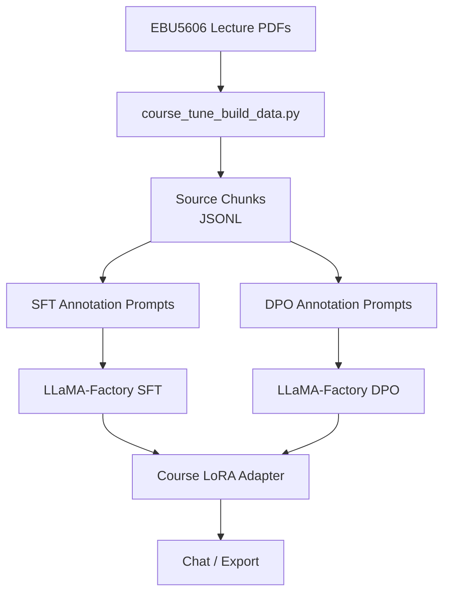

<p align="right">

English · [中文](README_zh.md)

</p>

<h1 align="center">CourseTune Product Development</h1>
<p align="center">
  <strong>A Qwen3 LoRA/DPO fine-tuning project for the EBU5606 Product Development course.</strong>
  <br />
  <em>LLaMA-Factory · Course PDF extraction · SFT · DPO · Gradio/WebUI-ready inference</em>
</p>

<p align="center">
  <a href="#quick-start"></a>
  <a href="LICENSE"></a>
</p>

<p align="center">
  
  
  
  
</p>

## Features

| Feature | Description |
|---|---|
| Course-specific data source | Uses the EBU5606 Product Development lecture PDFs from `/Users/gumishdo/Desktop/大三下/产开`. |
| Source extraction | Converts Topic lecture PDFs into source chunks for dataset construction. |
| SFT workflow | Registers a product-development SFT dataset in LLaMA-Factory. |
| DPO workflow | Registers a preference dataset for answer-style alignment. |
| Qwen3 LoRA configs | Adds SFT, DPO, inference, and LoRA merge YAML files. |
| Upstream attribution | Keeps the original LLaMA-Factory documentation as `UPSTREAM_README.md` and `UPSTREAM_README_zh.md`. |

## Quick Start

### Install

```bash
cd LLaMA-Factory
pip install -e .
pip install -r requirements/course_tune.txt
```

### Build Product Development Prompts

```bash
python scripts/course_tune_build_data.py \
  --source "/Users/gumishdo/Desktop/大三下/产开" \
  --name-regex "^(EBU5606 - Topic|EBU5606_Topic 11|Product Development)" \
  --mode sft_prompts \
  --out data/course_product_development_sft_prompts.jsonl
```

### Train

```bash
llamafactory-cli train examples/train_lora/qwen3_course_sft.yaml
llamafactory-cli train examples/train_lora/qwen3_course_dpo.yaml
```

### Run Inference

```bash
llamafactory-cli chat examples/inference/qwen3_course_lora.yaml
```

## Usage

### Extract Source Chunks

```bash
python scripts/course_tune_build_data.py \
  --source "/Users/gumishdo/Desktop/大三下/产开" \
  --name-regex "^(EBU5606 - Topic|EBU5606_Topic 11|Product Development)" \
  --mode chunks \
  --out data/course_product_development_chunks.jsonl
```

The current local extraction produced `948` source chunks, `948` SFT annotation prompts, and `948` DPO annotation prompts. These generated files are ignored by Git because they may contain course material text.

### Generate DPO Annotation Prompts

```bash
python scripts/course_tune_build_data.py \
  --source "/Users/gumishdo/Desktop/大三下/产开" \
  --name-regex "^(EBU5606 - Topic|EBU5606_Topic 11|Product Development)" \
  --mode dpo_prompts \
  --out data/course_product_development_dpo_prompts.jsonl
```

### Merge LoRA

```bash
llamafactory-cli export examples/merge_lora/qwen3_course_lora.yaml
```

## Architecture



## Configuration

| File | Purpose |
|---|---|
| `data/dataset_info.json` | Registers `course_product_development_sft` and `course_product_development_dpo`. |
| `examples/train_lora/qwen3_course_sft.yaml` | Qwen3 LoRA SFT training configuration. |
| `examples/train_lora/qwen3_course_dpo.yaml` | Qwen3 LoRA DPO training configuration. |
| `examples/inference/qwen3_course_lora.yaml` | Chat configuration for the course LoRA adapter. |
| `examples/merge_lora/qwen3_course_lora.yaml` | LoRA merge and export configuration. |
| `requirements/course_tune.txt` | Additional dependencies for PDF/PPTX extraction. |

## Project Structure

```text
data/
├── course_product_development_sft_sample.json     # Reviewed SFT sample
├── course_product_development_dpo_sample.json     # Reviewed DPO sample
└── dataset_info.json                              # LLaMA-Factory dataset registry
examples/
├── train_lora/                                    # SFT and DPO training configs
├── inference/                                     # Chat config
└── merge_lora/                                    # Export config
scripts/
└── course_tune_build_data.py                      # Course material extraction helper
COURSE_TUNE_ZH.md                                  # Chinese project workflow notes
UPSTREAM_README.md                                 # Original LLaMA-Factory README
UPSTREAM_README_zh.md                              # Original LLaMA-Factory Chinese README
```

## Tech Stack

| Layer | Technology | Purpose |
|---|---|---|
| Fine-tuning | LLaMA-Factory | SFT, DPO, LoRA, export, and chat workflows. |
| Base model | Qwen3 Instruct | Chinese-capable instruction model for course assistant tuning. |
| Data extraction | `pypdf`, `python-pptx` | PDF/PPTX lecture extraction. |
| Training backend | PyTorch, Transformers, PEFT, TRL | Model loading, adapter training, and preference optimization. |
| Interface | LLaMA Board / Gradio | Visual training and model interaction through LLaMA-Factory. |

## Upstream

This project is adapted from [hiyouga/LLaMA-Factory](https://github.com/hiyouga/LLaMA-Factory). The original README files are preserved as `UPSTREAM_README.md` and `UPSTREAM_README_zh.md`.

## License

[Apache-2.0](LICENSE)
