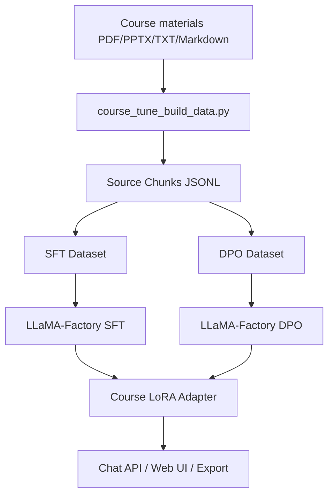

<p align="right">

English · [中文](README_zh.md)

</p>

<h1 align="center">CourseTune</h1>
<p align="center">
  <strong>Turn your own course materials into training data and fine-tune a Qwen3 LoRA course assistant.</strong>
  <br />
  <em>Course material extraction · SFT/DPO data construction · LoRA fine-tuning · Chinese test UI</em>
</p>

<p align="center">
  <a href="#quick-start"></a>
  <a href="LICENSE"></a>
</p>

<p align="center">
  
  
  
  
</p>

## Features

| Feature | Description |
|---|---|
| Custom course materials | Put your own PDF, PPTX, TXT, or Markdown file/folder path after `--source`. |
| Source-bound extraction | Converts materials into JSONL chunks with source file and page/slide location. |
| SFT and DPO data | Generates train-ready data or annotation prompts for manual review. |
| LoRA training configs | Provides Qwen3 LoRA SFT, DPO, inference, and merge YAML files. |
| Chinese test UI | Provides a browser UI that connects to a local OpenAI-compatible model API. |
| Public-safe repository | Generated course text, datasets, and model weights are ignored by default. |

## Quick Start

### Install

```bash
pip install -r requirements.txt
```

### Build SFT Data

Replace the value after `--source` with the path to your own course materials. It can be a single file or a folder.

```bash
python scripts/course_tune_build_data.py \
  --source "/path/to/your/course/materials" \
  --mode sft_dataset \
  --seed-json data/course_sft_sample.json \
  --seed-repeat 20 \
  --out data/course_sft.json
```

If you only want to include selected files, add `--name-regex`:

```bash
python scripts/course_tune_build_data.py \
  --source "/path/to/your/course/materials" \
  --name-regex "Lecture|Topic|Week" \
  --mode sft_dataset \
  --out data/course_sft.json
```

### Train

```bash
llamafactory-cli train examples/train_lora/qwen3_course_sft.yaml
```

### Start the Model API and Test UI

```bash
llamafactory-cli api examples/inference/qwen3_course_lora.yaml
python web/server.py --port 7860
```

Open `http://127.0.0.1:7860` to test the course assistant.

## Usage

### Extract Source Chunks

```bash
python scripts/course_tune_build_data.py \
  --source "/path/to/your/course/materials" \
  --mode chunks \
  --out data/course_chunks.jsonl
```

### Generate SFT Training Data

```bash
python scripts/course_tune_build_data.py \
  --source "/path/to/your/course/materials" \
  --mode sft_dataset \
  --seed-json data/course_sft_sample.json \
  --seed-repeat 20 \
  --out data/course_sft.json
```

`data/course_sft_sample.json` is a reviewed seed-data template. Replace it with high-quality examples for your own course, or remove `--seed-json` and `--seed-repeat` if you do not have reviewed seed rows yet.

### Generate DPO Annotation Prompts

```bash
python scripts/course_tune_build_data.py \
  --source "/path/to/your/course/materials" \
  --mode dpo_prompts \
  --out data/course_dpo_prompts.jsonl
```

### Generate DPO Training Data

```bash
python scripts/course_tune_build_data.py \
  --source "/path/to/your/course/materials" \
  --mode dpo_dataset \
  --out data/course_dpo.json
```

### Merge LoRA

```bash
llamafactory-cli export examples/merge_lora/qwen3_course_lora.yaml
```

## UI Preview

The Chinese test UI lives in `web/index.html` and uses `web/server.py` to proxy requests to the local model API. The preview below uses imported product-development course materials as an example conversation; replace `--source` with your own course material path to build the same workflow for another course.


## Example Training Record

| Item | Result |
|---|---|
| GPU | NVIDIA RTX 4090 24GB |
| Runtime | Ubuntu 22.04, PyTorch 2.5.1+cu124, LLaMA-Factory 0.9.5 |
| Base model | `Qwen/Qwen3-4B-Instruct-2507` |
| Method | LoRA SFT, rank 8, BF16 |
| Training data | `1996` SFT samples |
| Steps | `250` optimization steps |
| Training time | `11m47s` |
| Final train loss | `0.8136` |
| Local adapter path | `saves/qwen3-4b-course-assistant/lora/sft` |

This is an example training record showing the cost of a single-GPU run and the expected project output. Your dataset size, loss, and runtime will depend on your own course materials, data quality, and training parameters.

## Architecture



## Project Structure

```text
data/
├── course_sft_sample.json
├── course_dpo_sample.json
└── dataset_info.json
docs/
└── course-assistant-ui.png
examples/
├── train_lora/
│   ├── qwen3_course_sft.yaml
│   └── qwen3_course_dpo.yaml
├── inference/
│   └── qwen3_course_lora.yaml
└── merge_lora/
    └── qwen3_course_lora.yaml
scripts/
└── course_tune_build_data.py
web/
├── index.html
└── server.py
requirements.txt
```

## Tech Stack

| Layer | Technology | Purpose |
|---|---|---|
| Fine-tuning runtime | LLaMA-Factory | Runs SFT, DPO, LoRA merge, and chat workflows. |
| Base model | Qwen3 Instruct | Chinese-capable instruction model for course assistant tuning. |
| Data extraction | `pypdf`, `python-pptx` | Extracts PDF/PPTX course material content. |
| Training method | LoRA, DPO | Keeps training efficient and adds preference alignment. |

## Upstream

This project uses [hiyouga/LLaMA-Factory](https://github.com/hiyouga/LLaMA-Factory) as an external fine-tuning runtime.

## License

[Apache-2.0](LICENSE)
