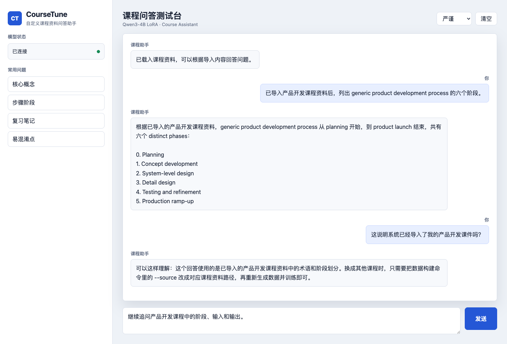
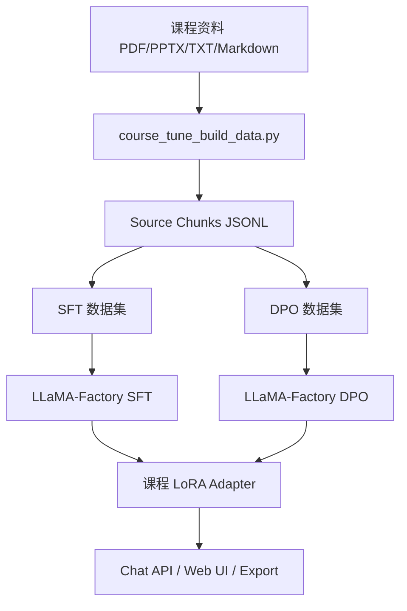

<p align="right">

[English](README.md) · 中文

</p>

<h1 align="center">CourseTune</h1>
<p align="center">
  <strong>把任意课程资料转换成可训练数据，并用 Qwen3 + LoRA 微调一个课程问答助手。</strong>
  <br />
  <em>课程资料抽取 · SFT/DPO 数据构建 · LoRA 微调 · 中文测试页面</em>
</p>

<p align="center">
  <a href="#快速开始"></a>
  <a href="LICENSE"></a>
</p>

<p align="center">
  
  
  
  
</p>

## 功能特性

| 功能 | 说明 |
|---|---|
| 自定义课程资料 | `--source` 可以填写你自己的 PDF、PPTX、TXT、Markdown 文件或文件夹路径。 |
| 资料抽取 | 将课程资料抽取成 JSONL 文本块，保留来源文件和页码/幻灯片位置。 |
| SFT 与 DPO 数据 | 支持直接生成训练数据，也支持生成标注提示词后人工校验。 |
| LoRA 训练配置 | 提供 Qwen3 LoRA SFT、DPO、推理和合并配置。 |
| 中文测试页面 | 提供可连接本地 OpenAI 兼容 API 的课程问答前端。 |
| 公开仓库安全 | 生成的课程原文、训练集和模型权重默认不提交。 |

## 快速开始

### 安装

```bash
pip install -r requirements.txt
```

### 构建 SFT 训练集

把 `--source` 后面的路径替换成你的课程资料路径，可以是一个文件，也可以是一个文件夹。

```bash
python scripts/course_tune_build_data.py \
  --source "/path/to/your/course/materials" \
  --mode sft_dataset \
  --seed-json data/course_sft_sample.json \
  --seed-repeat 20 \
  --out data/course_sft.json
```

如果只想抽取某些文件，可以加 `--name-regex`：

```bash
python scripts/course_tune_build_data.py \
  --source "/path/to/your/course/materials" \
  --name-regex "Lecture|Topic|Week" \
  --mode sft_dataset \
  --out data/course_sft.json
```

### 训练

```bash
llamafactory-cli train examples/train_lora/qwen3_course_sft.yaml
```

### 启动模型 API 和测试页面

```bash
llamafactory-cli api examples/inference/qwen3_course_lora.yaml
python web/server.py --port 7860
```

打开 `http://127.0.0.1:7860` 即可测试课程助手。

## 使用方法

### 抽取资料文本块

```bash
python scripts/course_tune_build_data.py \
  --source "/path/to/your/course/materials" \
  --mode chunks \
  --out data/course_chunks.jsonl
```

### 生成 SFT 训练集

```bash
python scripts/course_tune_build_data.py \
  --source "/path/to/your/course/materials" \
  --mode sft_dataset \
  --seed-json data/course_sft_sample.json \
  --seed-repeat 20 \
  --out data/course_sft.json
```

`data/course_sft_sample.json` 是人工校验样本模板。你可以替换成自己课程的高质量问答样本；如果暂时没有人工样本，可以去掉 `--seed-json` 和 `--seed-repeat`。

### 生成 DPO 标注提示词

```bash
python scripts/course_tune_build_data.py \
  --source "/path/to/your/course/materials" \
  --mode dpo_prompts \
  --out data/course_dpo_prompts.jsonl
```

### 生成 DPO 训练集

```bash
python scripts/course_tune_build_data.py \
  --source "/path/to/your/course/materials" \
  --mode dpo_dataset \
  --out data/course_dpo.json
```

### 合并 LoRA

```bash
llamafactory-cli export examples/merge_lora/qwen3_course_lora.yaml
```

## 页面展示

中文测试页面位于 `web/index.html`，通过 `web/server.py` 代理到本地模型 API。下图使用已导入的产品开发课件做示例问答；把 `--source` 替换成你自己的课程资料路径后，也可以用于其他课程。



## 示例训练记录

| 项目 | 结果 |
|---|---|
| 训练设备 | NVIDIA RTX 4090 24GB |
| 运行环境 | Ubuntu 22.04, PyTorch 2.5.1+cu124, LLaMA-Factory 0.9.5 |
| 基座模型 | `Qwen/Qwen3-4B-Instruct-2507` |
| 训练方法 | LoRA SFT, rank 8, BF16 |
| 训练数据 | `1996` 条 SFT 样本 |
| 训练步数 | `250` optimization steps |
| 训练耗时 | `11m47s` |
| 最终 train loss | `0.8136` |
| 本地权重路径 | `saves/qwen3-4b-course-assistant/lora/sft` |

这是一组示例训练记录，用来展示单卡训练成本和项目完成度。实际样本数、loss 和训练时间会随你的课程资料数量、数据质量和训练参数变化。

## 架构



## 项目结构

```text
data/
├── course_sft_sample.json
├── course_dpo_sample.json
└── dataset_info.json
docs/
└── course-assistant-ui.png
examples/
├── train_lora/
│   ├── qwen3_course_sft.yaml
│   └── qwen3_course_dpo.yaml
├── inference/
│   └── qwen3_course_lora.yaml
└── merge_lora/
    └── qwen3_course_lora.yaml
scripts/
└── course_tune_build_data.py
web/
├── index.html
└── server.py
requirements.txt
```

## 技术栈

| 层级 | 技术 | 用途 |
|---|---|---|
| 微调运行时 | LLaMA-Factory | 运行 SFT、DPO、LoRA 合并和聊天流程。 |
| 基座模型 | Qwen3 Instruct | 面向中文课程问答的指令模型。 |
| 数据抽取 | `pypdf`, `python-pptx` | 抽取 PDF/PPTX 课件内容。 |
| 训练方法 | LoRA, DPO | 降低训练成本并加入偏好对齐。 |

## 上游项目

本项目使用 [hiyouga/LLaMA-Factory](https://github.com/hiyouga/LLaMA-Factory) 作为外部微调运行时。

## 许可证

[Apache-2.0](LICENSE)
