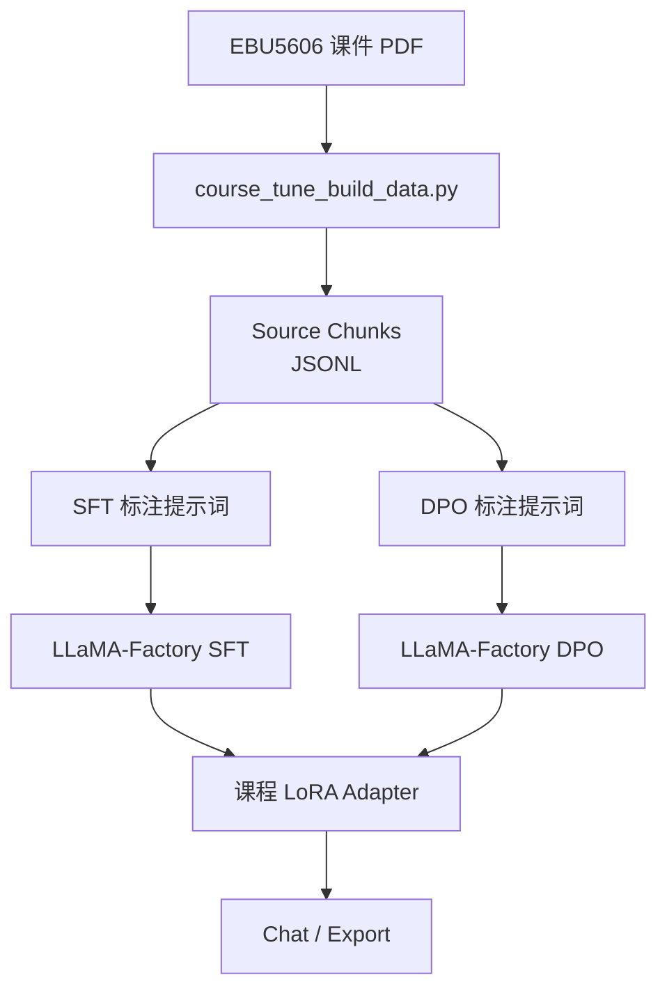

<p align="right">

[English](README.md) · 中文

</p>

<h1 align="center">CourseTune Product Development</h1>
<p align="center">
  <strong>面向 EBU5606 产品开发课程的 Qwen3 LoRA/DPO 微调项目。</strong>
  <br />
  <em>LLaMA-Factory · 课程 PDF 抽取 · SFT · DPO · Gradio/WebUI 推理</em>
</p>

<p align="center">
  <a href="#快速开始"></a>
  <a href="LICENSE"></a>
</p>

<p align="center">
  
  
  
  
</p>

## 功能特性

| 功能 | 说明 |
|---|---|
| 课程专用数据源 | 使用 `/Users/gumishdo/Desktop/大三下/产开` 中的 EBU5606 产品开发课件 PDF。 |
| 资料抽取 | 将 Topic 课件 PDF 转为可用于数据构建的 source chunks。 |
| SFT 流程 | 在 LLaMA-Factory 中注册产品开发 SFT 数据集。 |
| DPO 流程 | 注册偏好数据集，用于回答风格和忠实度对齐。 |
| Qwen3 LoRA 配置 | 增加 SFT、DPO、推理和 LoRA 合并配置。 |
| 上游归属保留 | 原始 LLaMA-Factory README 保留为 `UPSTREAM_README.md` 和 `UPSTREAM_README_zh.md`。 |

## 快速开始

### 安装

```bash
cd LLaMA-Factory
pip install -e .
pip install -r requirements/course_tune.txt
```

### 构建产品开发标注提示词

```bash
python scripts/course_tune_build_data.py \
  --source "/Users/gumishdo/Desktop/大三下/产开" \
  --name-regex "^(EBU5606 - Topic|EBU5606_Topic 11|Product Development)" \
  --mode sft_prompts \
  --out data/course_product_development_sft_prompts.jsonl
```

### 训练

```bash
llamafactory-cli train examples/train_lora/qwen3_course_sft.yaml
llamafactory-cli train examples/train_lora/qwen3_course_dpo.yaml
```

### 推理

```bash
llamafactory-cli chat examples/inference/qwen3_course_lora.yaml
```

## 使用方法

### 抽取资料文本块

```bash
python scripts/course_tune_build_data.py \
  --source "/Users/gumishdo/Desktop/大三下/产开" \
  --name-regex "^(EBU5606 - Topic|EBU5606_Topic 11|Product Development)" \
  --mode chunks \
  --out data/course_product_development_chunks.jsonl
```

当前本地已经生成 `948` 个 source chunks、`948` 条 SFT 标注提示词和 `948` 条 DPO 标注提示词。这些生成文件可能包含课程资料原文，因此已经加入 `.gitignore`，不会直接上传到 GitHub。

### 生成 DPO 标注提示词

```bash
python scripts/course_tune_build_data.py \
  --source "/Users/gumishdo/Desktop/大三下/产开" \
  --name-regex "^(EBU5606 - Topic|EBU5606_Topic 11|Product Development)" \
  --mode dpo_prompts \
  --out data/course_product_development_dpo_prompts.jsonl
```

### 合并 LoRA

```bash
llamafactory-cli export examples/merge_lora/qwen3_course_lora.yaml
```

## 架构



## 配置

| 文件 | 用途 |
|---|---|
| `data/dataset_info.json` | 注册 `course_product_development_sft` 和 `course_product_development_dpo`。 |
| `examples/train_lora/qwen3_course_sft.yaml` | Qwen3 LoRA SFT 训练配置。 |
| `examples/train_lora/qwen3_course_dpo.yaml` | Qwen3 LoRA DPO 训练配置。 |
| `examples/inference/qwen3_course_lora.yaml` | 加载课程 LoRA adapter 的聊天配置。 |
| `examples/merge_lora/qwen3_course_lora.yaml` | LoRA 合并和导出配置。 |
| `requirements/course_tune.txt` | PDF/PPTX 抽取所需的额外依赖。 |

## 项目结构

```text
data/
├── course_product_development_sft_sample.json     # 已整理 SFT 样例
├── course_product_development_dpo_sample.json     # 已整理 DPO 样例
└── dataset_info.json                              # LLaMA-Factory 数据集注册表
examples/
├── train_lora/                                    # SFT 和 DPO 训练配置
├── inference/                                     # 聊天配置
└── merge_lora/                                    # 导出配置
scripts/
└── course_tune_build_data.py                      # 课程资料抽取脚本
COURSE_TUNE_ZH.md                                  # 中文项目流程说明
UPSTREAM_README.md                                 # 原始 LLaMA-Factory README
UPSTREAM_README_zh.md                              # 原始 LLaMA-Factory 中文 README
```

## 技术栈

| 层级 | 技术 | 用途 |
|---|---|---|
| 微调框架 | LLaMA-Factory | SFT、DPO、LoRA、导出和聊天流程。 |
| 基座模型 | Qwen3 Instruct | 面向中文课程问答的指令模型。 |
| 数据抽取 | `pypdf`, `python-pptx` | 抽取 PDF/PPTX 课件文本。 |
| 训练后端 | PyTorch, Transformers, PEFT, TRL | 模型加载、adapter 训练和偏好优化。 |
| 界面 | LLaMA Board / Gradio | 使用 LLaMA-Factory 进行可视化训练和交互。 |

## 上游项目

本项目基于 [hiyouga/LLaMA-Factory](https://github.com/hiyouga/LLaMA-Factory) 改造。原始 README 已保留为 `UPSTREAM_README.md` 和 `UPSTREAM_README_zh.md`。

## 许可证

[Apache-2.0](LICENSE)
