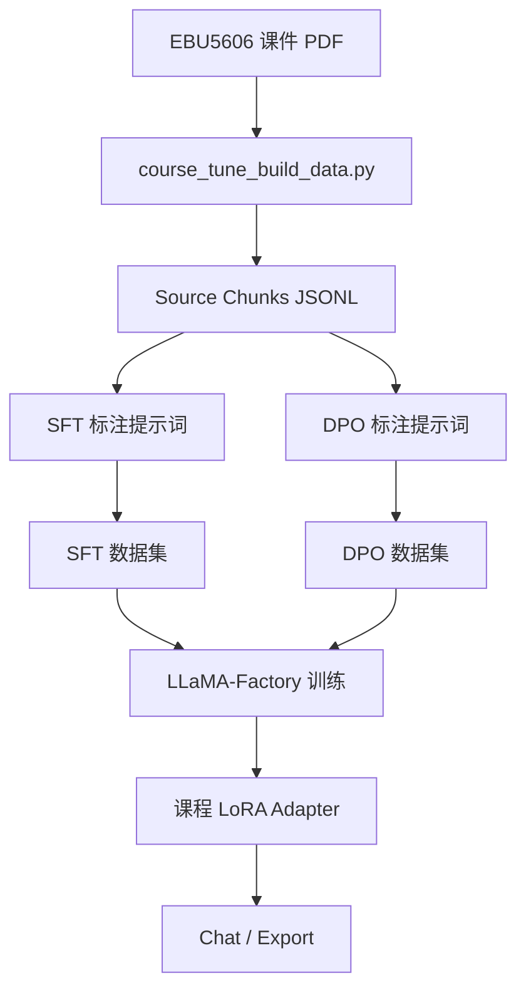

<p align="right">

[English](README.md) · 中文

</p>

<h1 align="center">CourseTune Product Development</h1>
<p align="center">
  <strong>面向 EBU5606 产品开发课程的轻量级 Qwen3 LoRA/DPO 微调项目。</strong>
  <br />
  <em>课程 PDF 抽取 · SFT 数据构建 · DPO 偏好对齐 · LLaMA-Factory 配置</em>
</p>

<p align="center">
  <a href="#快速开始"></a>
  <a href="LICENSE"></a>
</p>

<p align="center">
  
  
  
  
</p>

## 功能特性

| 功能 | 说明 |
|---|---|
| 课程专用数据集 | 从 EBU5606 产品开发课件 PDF 构建训练数据。 |
| 源资料抽取 | 将本地 PDF/PPTX/TXT/Markdown 转成 JSONL 文本块和标注提示词。 |
| SFT 与 DPO 样例 | 提供已整理的监督微调样例和偏好对齐样例。 |
| 训练配置 | 提供 Qwen3 LoRA SFT、DPO、推理和合并配置。 |
| 公开仓库安全 | 生成的 chunks 和 prompts 可能包含课程原文，因此默认不提交。 |

## 快速开始

### 安装

```bash
pip install -r requirements.txt
```

### 构建产品开发标注提示词

```bash
python scripts/course_tune_build_data.py \
  --source "/Users/gumishdo/Desktop/大三下/产开" \
  --name-regex "^(EBU5606 - Topic|EBU5606_Topic 11|Product Development)" \
  --mode sft_prompts \
  --out data/course_product_development_sft_prompts.jsonl
```

### 训练

```bash
llamafactory-cli train examples/train_lora/qwen3_course_sft.yaml
llamafactory-cli train examples/train_lora/qwen3_course_dpo.yaml
```

### 推理

```bash
llamafactory-cli chat examples/inference/qwen3_course_lora.yaml
```

## 使用方法

### 抽取资料文本块

```bash
python scripts/course_tune_build_data.py \
  --source "/Users/gumishdo/Desktop/大三下/产开" \
  --name-regex "^(EBU5606 - Topic|EBU5606_Topic 11|Product Development)" \
  --mode chunks \
  --out data/course_product_development_chunks.jsonl
```

本地已生成 `948` 个 source chunks、`948` 条 SFT 标注提示词和 `948` 条 DPO 标注提示词。这些文件已加入 `.gitignore`。

### 生成 DPO 标注提示词

```bash
python scripts/course_tune_build_data.py \
  --source "/Users/gumishdo/Desktop/大三下/产开" \
  --name-regex "^(EBU5606 - Topic|EBU5606_Topic 11|Product Development)" \
  --mode dpo_prompts \
  --out data/course_product_development_dpo_prompts.jsonl
```

### 合并 LoRA

```bash
llamafactory-cli export examples/merge_lora/qwen3_course_lora.yaml
```

## 架构



## 项目结构

```text
data/
├── course_product_development_sft_sample.json
├── course_product_development_dpo_sample.json
└── dataset_info.json
examples/
├── train_lora/
│   ├── qwen3_course_sft.yaml
│   └── qwen3_course_dpo.yaml
├── inference/
│   └── qwen3_course_lora.yaml
└── merge_lora/
    └── qwen3_course_lora.yaml
scripts/
└── course_tune_build_data.py
requirements.txt
```

## 技术栈

| 层级 | 技术 | 用途 |
|---|---|---|
| 微调运行时 | LLaMA-Factory | 运行 SFT、DPO、LoRA 合并和聊天流程。 |
| 基座模型 | Qwen3 Instruct | 面向中文课程问答的指令模型。 |
| 数据抽取 | `pypdf`, `python-pptx` | 抽取 PDF/PPTX 课件内容。 |
| 训练方法 | LoRA, DPO | 降低训练成本并加入偏好对齐。 |

## 上游项目

本项目使用 [hiyouga/LLaMA-Factory](https://github.com/hiyouga/LLaMA-Factory) 作为外部微调运行时。

## 许可证

[Apache-2.0](LICENSE)
