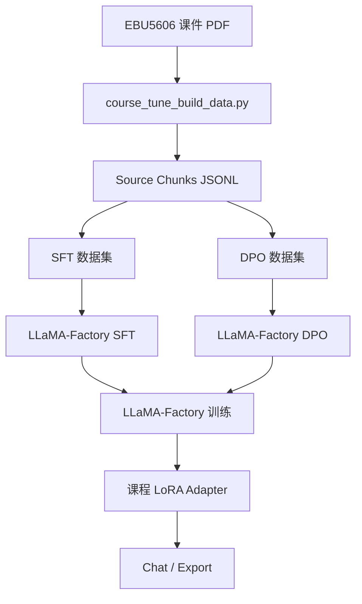

<p align="right">

[English](README.md) · 中文

</p>

<h1 align="center">CourseTune Product Development</h1>
<p align="center">
  <strong>面向 EBU5606 产品开发课程的轻量级 Qwen3 LoRA/DPO 微调项目。</strong>
  <br />
  <em>课程 PDF 抽取 · SFT 数据构建 · LoRA 微调 · 中文测试页面</em>
</p>

<p align="center">
  <a href="#快速开始"></a>
  <a href="LICENSE"></a>
</p>

<p align="center">
  
  
  
  
</p>

## 功能特性

| 功能 | 说明 |
|---|---|
| 课程专用数据集 | 从 EBU5606 产品开发课件 PDF 构建训练数据。 |
| 源资料抽取 | 将本地 PDF/PPTX/TXT/Markdown 转成 JSONL 文本块和标注提示词。 |
| SFT 与 DPO 样例 | 提供已整理的监督微调样例和偏好对齐样例。 |
| 训练配置 | 提供 Qwen3 LoRA SFT、DPO、推理和合并配置。 |
| 中文测试页面 | 提供可连接本地 OpenAI 兼容 API 的课程问答前端。 |
| 公开仓库安全 | 生成的 chunks 和 prompts 可能包含课程原文，因此默认不提交。 |

## 快速开始

### 安装

```bash
pip install -r requirements.txt
```

### 构建产品开发 SFT 训练集

```bash
python scripts/course_tune_build_data.py \
  --source "/Users/gumishdo/Desktop/大三下/产开" \
  --name-regex "^(EBU5606 - Topic|EBU5606_Topic 11|Product Development)" \
  --mode sft_dataset \
  --seed-json data/course_product_development_sft_sample.json \
  --seed-repeat 20 \
  --out data/course_product_development_sft.json
```

### 训练

```bash
llamafactory-cli train examples/train_lora/qwen3_course_sft.yaml
llamafactory-cli train examples/train_lora/qwen3_course_dpo.yaml
```

### 启动模型 API 和测试页面

```bash
llamafactory-cli api examples/inference/qwen3_course_lora.yaml
python web/server.py --port 7860
```

打开 `http://127.0.0.1:7860` 即可测试课程助手。

## 使用方法

### 抽取资料文本块

```bash
python scripts/course_tune_build_data.py \
  --source "/Users/gumishdo/Desktop/大三下/产开" \
  --name-regex "^(EBU5606 - Topic|EBU5606_Topic 11|Product Development)" \
  --mode chunks \
  --out data/course_product_development_chunks.jsonl
```

本地已生成 `948` 个 source chunks、`948` 条 SFT 标注提示词、`948` 条 DPO 标注提示词、`1996` 条 SFT 训练样本和 `948` 条 DPO 偏好样本。SFT 训练集由 `1896` 条自动抽取样本加 `5` 条人工校验样本重复 `20` 次组成。包含课程原文的生成文件已加入 `.gitignore`。

### 生成 SFT 训练集

```bash
python scripts/course_tune_build_data.py \
  --source "/Users/gumishdo/Desktop/大三下/产开" \
  --name-regex "^(EBU5606 - Topic|EBU5606_Topic 11|Product Development)" \
  --mode sft_dataset \
  --seed-json data/course_product_development_sft_sample.json \
  --seed-repeat 20 \
  --out data/course_product_development_sft.json
```

### 生成 DPO 标注提示词

```bash
python scripts/course_tune_build_data.py \
  --source "/Users/gumishdo/Desktop/大三下/产开" \
  --name-regex "^(EBU5606 - Topic|EBU5606_Topic 11|Product Development)" \
  --mode dpo_prompts \
  --out data/course_product_development_dpo_prompts.jsonl
```

### 生成 DPO 训练集

```bash
python scripts/course_tune_build_data.py \
  --source "/Users/gumishdo/Desktop/大三下/产开" \
  --name-regex "^(EBU5606 - Topic|EBU5606_Topic 11|Product Development)" \
  --mode dpo_dataset \
  --out data/course_product_development_dpo.json
```

### 合并 LoRA

```bash
llamafactory-cli export examples/merge_lora/qwen3_course_lora.yaml
```

## 页面展示

中文测试页面位于 `web/index.html`，通过 `web/server.py` 代理到本地模型 API。


## 训练结果

| 项目 | 结果 |
|---|---|
| 训练设备 | NVIDIA RTX 4090 24GB |
| 运行环境 | Ubuntu 22.04, PyTorch 2.5.1+cu124, LLaMA-Factory 0.9.5 |
| 基座模型 | `Qwen/Qwen3-4B-Instruct-2507` |
| 训练方法 | LoRA SFT, rank 8, BF16 |
| 训练数据 | `1996` 条 SFT 样本 |
| 训练步数 | `250` optimization steps |
| 训练耗时 | `11m47s` |
| 最终 train loss | `0.8136` |
| 本地权重路径 | `saves/qwen3-4b-product-development/lora/sft` |

验证问题：

```text
列出 generic product development process 的六个阶段。
```

模型返回了课程中的六个阶段：`Planning`、`Concept development`、`System-level design`、`Detail design`、`Testing and refinement`、`Production ramp-up`。前端代理 `/api/chat` 已通过同一问题验证。

## 架构



## 项目结构

```text
data/
├── course_product_development_sft_sample.json
├── course_product_development_dpo_sample.json
└── dataset_info.json
docs/
└── course-assistant-ui.png
examples/
├── train_lora/
│   ├── qwen3_course_sft.yaml
│   └── qwen3_course_dpo.yaml
├── inference/
│   └── qwen3_course_lora.yaml
└── merge_lora/
    └── qwen3_course_lora.yaml
scripts/
└── course_tune_build_data.py
web/
├── index.html
└── server.py
requirements.txt
```

## 技术栈

| 层级 | 技术 | 用途 |
|---|---|---|
| 微调运行时 | LLaMA-Factory | 运行 SFT、DPO、LoRA 合并和聊天流程。 |
| 基座模型 | Qwen3 Instruct | 面向中文课程问答的指令模型。 |
| 数据抽取 | `pypdf`, `python-pptx` | 抽取 PDF/PPTX 课件内容。 |
| 训练方法 | LoRA, DPO | 降低训练成本并加入偏好对齐。 |

## 上游项目

本项目使用 [hiyouga/LLaMA-Factory](https://github.com/hiyouga/LLaMA-Factory) 作为外部微调运行时。

## 许可证

[Apache-2.0](LICENSE)
